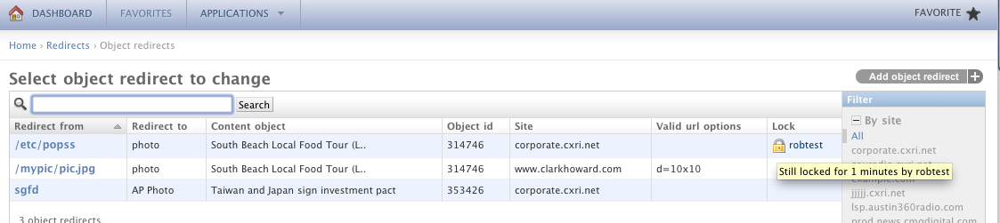
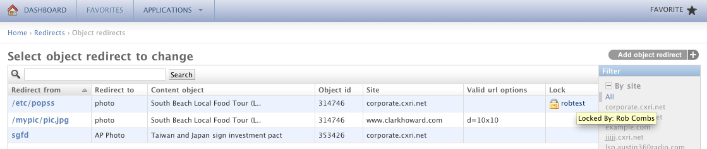
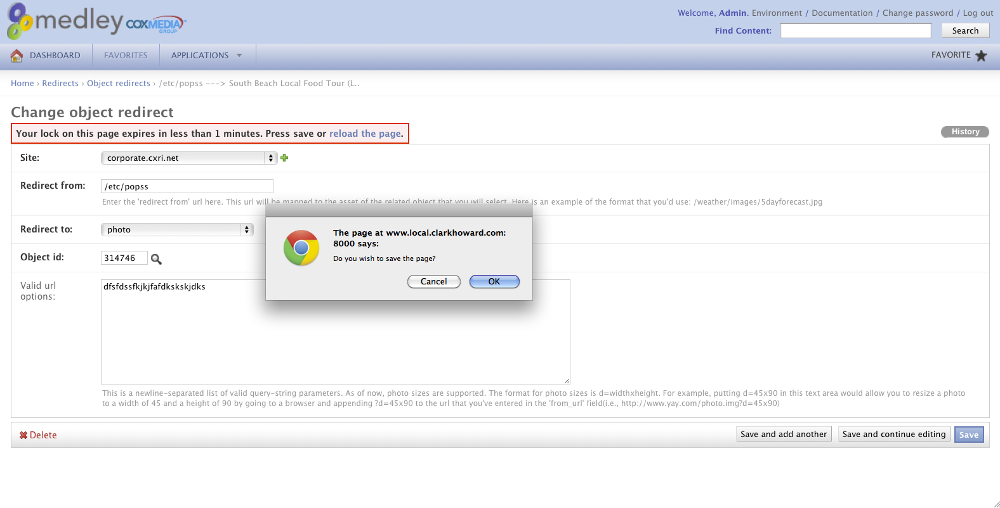
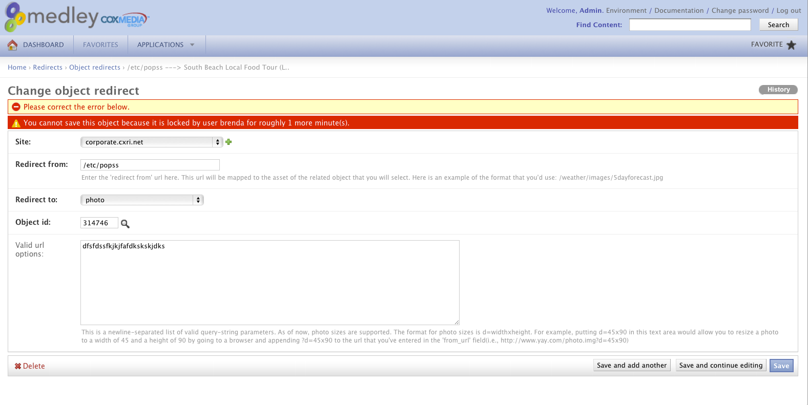

=======================================
Concurrency control with django-locking
=======================================

Django has seen great adoption in the content management sphere, especially among the newspaper crowd. One of the trickier things to get right, is to make sure that nobody steps on each others toes while editing and modifying existing content. Newspaper editors might not always be aware of what other editors are up to, and this goes double for distributed teams. When different people work on the same content, the one who saves last will win the day, while the other edits are overwritten.

django-locking provides a system that makes concurrent editing impossible, and informs users of what other users are working on and for how long that content will remain locked. Users can still read locked content, but cannot modify or save it.

django-locking makes sure no two users can edit the same content at the same time, preventing annoying overwrites and lost time. Find the repository and download the code at http://github.com/stdbrouw/django-locking

django-locking has only been tested on Django 1.2 and 1.3, but probably works from 1.0 onwards.

Documentation
-------------
Forked from the Django Locking plugin at stdbrouw/django-locking, this code features the cream of the crop for django-locking combining features from over 4 repos!

External hyperlinks, like Python_.
.. _Python: http://www.python.org/

New features added to this fork
===============================
Changes on change list pages
----------------------------

Unlock content object from change list page by simply clicking on the lock icon
_______________________________________________________________________________

.. image:: https://skitch.com/robertlcombs/g1177/screen-shot-2011-12-19-at-4.36.55-pm

Hover over the lock icon to see when the lock expires
_____________________________________________________

Hover over the username by the lock icon to see the full name of the person who has locked the content object 
_____________________________________________________________________________________________________________

Consolidated username and lock icon into one column on change list page
Changes in settings:
----------------------------

Added Lock warning and expiration flags in terms of seconds

Lock messages:
----------------------------

Added options to reload or save the object when lock expiration message is shown

Improved look and feel for the lock messages
Lock messages fade in and out seamlessly
Added much more detail to let users know who the content object was locked by providing the username, first name and last name
Added lock expiration warnings
Shows how much longer the object is locked for in minutes

Locking:
----------------------------

 Added hard locking support using Django's validation framework

 Set hard and soft locking as the default to ensure the integrity of locking
 Added seamless unlocking when lock expires

.. image:: docs/screenshots/auto_expire.png

Architecture:
----------------------------

1 model tracks lock information and that's it!  No messy migrations for each model that needs locking.
Refactored and cleaned up code for easier maintainability
 Simplified installation by coupling common functionality into base admin/form/model classes

10 Minute Install
-----------------

1) Get the code

::

   git clone git@github.com:RobCombs/django-locking.git

2) Add locking to list of INSTALLED_APPS in project settings file

::

   INSTALLED_APPS = ('locking',)

3) Copy the media (with all of the js/css/img stuff) directory to your admin media directory

::

   cp -r locking/media/locking $your admin media directory

Note: You can quickly test the media installation by hitting a locking media resource locally like so
http://www.local.wsbradio.com:8000/media/locking/js/admin.locking.js
If the url resolves, then you've completed this step correctly!  
Basically, the code refers to the media like so.  That's why you needed to do this step.
class Media:
   js = ( 'http://ajax.googleapis.com/ajax/libs/jquery/1.4.2/jquery.min.js', 
         'locking/js/jquery.url.packed.js',
         "/admin/ajax/variables.js",
         "locking/js/admin.locking.js?v=1")

   css = {"all": ("locking/css/locking.css",)
   }

4) Add locking to the admin files that you want locking for

::

   from locking.admin import LockableAdmin
   class YourAdmin(LockableAdmin):
       list_display = ('get_lock_for_admin')
5) Add warning and expiration time outs to your Django settings file

::

   LOCKING = {'time_until_expiration': 120, 'time_until_warning': 60}

6) Build the Lock table in the database

::

  django-admin.py/manage.py migrate locking (For south users. Recommended approach) OR
  django-admin.py/manage.py syncdb (For non south users)

That's it!

Optional
--------
If you'd like to enforce hard locking(recommended), then add the LockingForm class to the same admin pages
Example:
from locking.forms import LockingForm
class YourAdmin(LockableAdmin):
     list_display = ('get_lock_for_admin')
     form = LockingForm
Note: if you have an existing form and clean method, then call super to invoke the LockingForm's clean method
Example:
from locking.forms import LockingForm
class YourFormForm(LockingForm):
      def clean(self):
        self.cleaned_data = super(MedleyRedirectForm, self).clean()
        ...some code
        return self.cleaned_data

CREDIT
------
This code is basically a composition of the following repos with a taste of detailed descretion from me. Credit goes out to the following authors and repos for their contributions
and my job for funding this project:
https://github.com/stdbrouw/django-locking
https://github.com/runekaagaard/django-locking
https://github.com/theatlantic/django-locking
https://github.com/ortsed/django-locking

